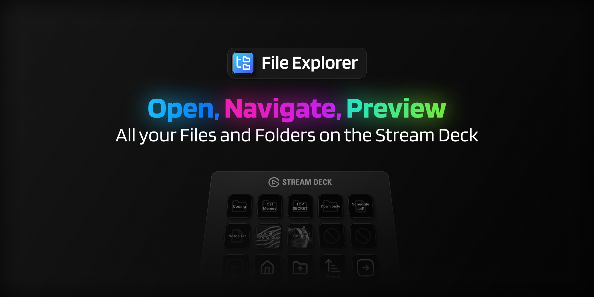
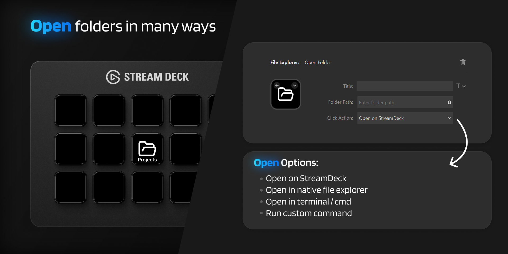
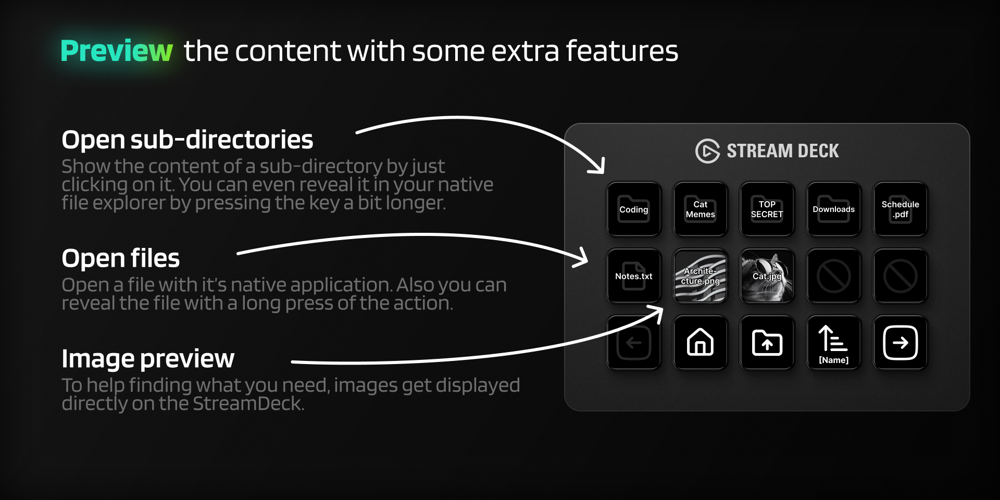
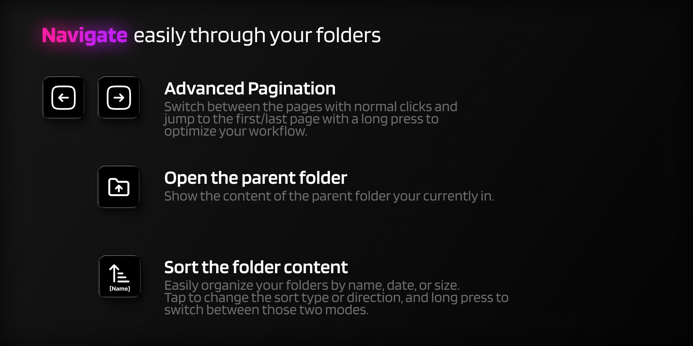
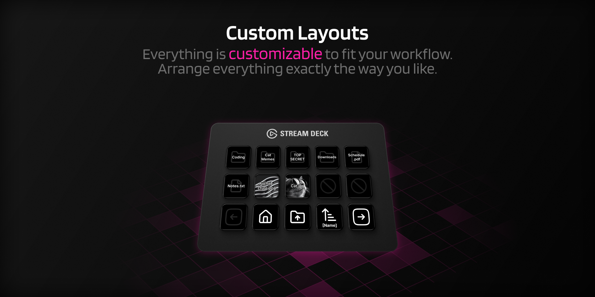

# File Explorer Plugin for Elgato Streamdeck
<a href="https://marketplace.elgato.com/product/fileexplorer-fcf4f735-1737-440c-a829-4e51578f58eb"></a>

Explore your files and folders without ever leaving your Stream Deck.
The **File Explorer Plugin** lets you **browse directories, preview images, open folders,** and even **run custom commands.** All directly from your Stream Deck keys.

Open folders and view their contents right on your Stream Deck, navigate through sub-directories, and open files with a single click.
**Images are displayed directly on the keys**, while pagination, parent folder navigation, and customizable click actions make managing your files seamless and intuitive.

**Enjoying the plugin?** ⭐ Star the repo and share your feedback to make it even better!

<a href="https://marketplace.elgato.com/product/fileexplorer-fcf4f735-1737-440c-a829-4e51578f58eb" height="20"></a>


# ✨ Features
> [!TIP]
> Feel free to contribute, report issues, or suggest new features whenever you notice something missing.

- 📁 **Browse Files & Folders**: `View and navigate directories directly on your Stream Deck.`
- 🔧 **Configurable Options**: `Specify in detail what each button should do.`
- 🖼️ **Thumbnail Previews**: `Images are displayed as thumbnails on the keys for quick identification.`
- 🔄 **Pagination Support**: `Scroll through large directories with ease using paginated views.`
- ⬆️ **Folder Navigation**: `Open sub directories or return to the parent directory quickly with a single click.`
- 🖱️ **Custom Actions**: `Open folders and files directly in your system’s file explorer or even execute shell commands on them.`
- 🔢 **Sorting**: `Sort the displayed items by name, size and modification date.`
- ⚙️ **Customizable Layout**: `Arrange folder content and navigation buttons to match your workflow.`

💡 *Tip: <ins>**Long press**</ins> actions are available alongside clicks, providing extra functionality and improving UX.*

<details open>
  <summary>Image Gallery</summary>
  <div style="display: flex; flex-wrap: wrap;">
    
    
    
    
  </div>
</details>

<br><br><br>

## 📖 Actions in Detail:
- [Open Folder](#open-folder)
- [Open parent folder](#open-parent-folder)
- [Pagination (left & right)](#pagination-left--right)
- [Sort Button](#sort-button)
- [Folder Item View](#folder-item-view) (Displays the actual content)


<br><br>


## Open Folder
This action allows you to open your local folders directly from the Stream Deck.  
In addition, you can open them in your native file explorer, in the CMD/Terminal, or even execute custom scripts using the folder path as a variable.

### ⚙️ Settings
- `Folder:`<br>
  This is your input for which folderpath you want to open.

- `Click Action:`<br>
  A dropdown to choose what happens when you press the button. Available options are:
  - `Open on StreamDeck:` Displays the folder content using the [Folder Item View](#folder-item-view) actions on the StreamDeck.
      - If selected, you can choose to automatically open the profile provided by the plugin.
      - For maximum flexibility, use a Multi Action that combines the Open action with, for example, the built-in Switch Profile action to achieve similar behavior.
  - `Open in native file explorer:` Opens the folderpath using your systems native file explorer.
  - `Open in Terminal / CMD:` Opens the folderpath in your native terminal/cmd.
  - `Run custom command (advanced):` Specify a custom run command. You can use `{path}` as variable in your command to execute all kind of things related to that folderpath.


<br><br>


## Open parent folder
This action changes the current view on the Stream Deck to the **parent directory**, if one is currently open.  
It allows you to quickly navigate back up the folder hierarchy without reconfiguring the plugin or pressing multiple keys.

### ⚙️ Settings
> There are currently no settings for this action.<br>
> Feel free to suggest ideas or open a pull request if you’d like to add configuration options!


<br><br>


## Pagination (left & right)
This action allows you to navigate through folders that contain more items than can fit on a single Stream Deck page.
It can also show the current page and has option to jump to the first/last page on a long press.

### ⚙️ Settings
- `Title Display:` Specify wheter the current page and the total amount of pages should get displayed on the key using it's title.
- `Click Action:` Choose between `Next/Previous Page` and `Last/First Page`
- `Long Press:`: Choose between `Next/Previous Page` and `Last/First Page`. You can also specify after how many milliseconds a long press is triggered (default is 500ms).


<br><br>


## Sort Button
This action will sort the folder content on the StreamDeck based on your preferences. You can switch between two cycling states by a long press.
One cycling state allows to switch between ascending and descending. The other changes by what criteria is being cycled (Name, Last Modified, Size). 

### ⚙️ Settings
- `Directories:` Choose if you want folders to be always appear first or if they should be treated like other files in the sorting proccess.
- `Click Action:` Choose between `Change Type (Name/Date/Size)` and `Change Direction (Asc/Desc)`
- `Long Press:` If activated the setting above (`Click Action`) gets toggled. So on a long press it would switch beteen the two cycling modes.
- `Title:` If activated the title of that key gets updated to the current Sort Type to better know what would get changed if you press that button.

> [!WARNING]
> Folders can't be sorted by size at the moment since it would need a recursive algorithm to count the total bytes of that folder which is very time inefficient.


<br><br>


## Folder Item View
This action is essential if you want to display the folder content on the StreamDeck. It will display the the current item (at a specified offfset index) of the folder.
You can put as many actions as you want on your StreamDeck page. Don't forget to increase the `View Index` setting so pagination works correctly.

### ⚙️ Settings
- `View Index:` The offset of the item that sould get displayed of the folder content. Starting at **1**!

### 💡 Hints for Clicking
- **Normal Press**<br>
    _If the current displayed item is a ..._
    - **File** -> It will be opened using the native application associated with that file type.
    - **Folder** -> The StreamDeck view/content get's switched to the clicked folder.
- **Long Press (0.5s)**<br>
    _If the current displayed item is a ..._
    - **File** -> The file will be shown in the native file explorer.
    - **Folder** -> The folder will be opened in the native file explorer.


<br><br>


## 🔧 For Developers

### Installation (Local Development)
1. Clone this repository:
    ```bash
    git clone https://github.com/ArtusLama/streamdeck-fileexplorer.git
    ```
2. Uninstall your current FileExplorer Plugin _(only if already installed)_
   - Open the Stream Deck `Settings`
   - Go to the `Plugins` tab
   - `Right-Click` the FileExplorer Plugin
   - Click `Uninstall`
3. Link the local plugin to the StreamDeck:
   - Install the StreamDeck CLI
     ```bash
     npm install -g @elgato/cli
     ```
   - Navigate into the repository directory and link the plugin:
     ```bash
     streamdeck link de.artus.fileexplorer.sdPlugin
      ```
4. Start the plugin:
   Run the watcher to automatically rebuild on file changes:
   ```bash
   npm run watch
    ```

If things don’t work as expected, please refer to the official [StreamDeck Plugin Documentation](https://docs.elgato.com/streamdeck/sdk/introduction/getting-started).


<br><br><br>

## 📜 License

This project is licensed under the [MIT License](LICENSE).


